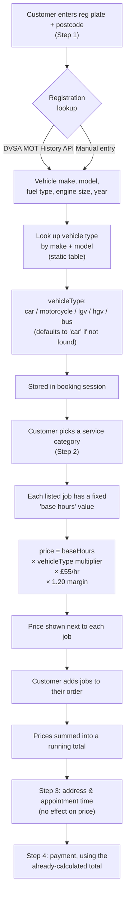

# Pricing Model — How a Price Is Calculated

This explains, in plain terms, what happens between a customer entering their
reg plate and seeing a price on screen — and what maths sits behind that price.

## The short version

```
Price shown to customer = Base hours for the job
                         × Multiplier for the vehicle type
                         × £55/hour labour rate
                         × 1.20 (20% platform margin)
                         (rounded to the nearest whole £)
```

Nothing else feeds into it. No postcode/location factor, no time-of-day
factor, no mechanic-availability factor, no separate VAT line — those are not
part of the sum today, even though VAT is mentioned as included in a
disclaimer on screen.

## The flow, step by step



## Where the vehicle type comes from — and what it doesn't use

This is the part worth flagging: **the "vehicle type" that drives pricing is
not derived from the DVLA/MOT record itself.** The MOT lookup returns make,
model, fuel type, engine size, and year — but only **make + model** are used,
matched against a hand-maintained list that sorts every make/model pair into
one of five buckets. Engine size, fuel type, and vehicle year are captured
and displayed, but play no role in the price.

If a make/model combination isn't in that list — including ones returned by
the DVSA lookup that don't match the list's exact spelling — it silently
falls back to being priced as a car.

## The five vehicle-type multipliers

| Vehicle type | Multiplier | Basis |
|---|---|---|
| Car | ×1.0 | Reference point — everything else is relative to this |
| Motorcycle | ×0.55 | Smaller parts, faster fluid/parts swaps |
| LGV (light van) | ×1.15 | Car-like mechanically, bigger panels/wheels/fluids |
| HGV (heavy goods) | ×1.85 | Different class — air brakes, heavier parts, lifting gear |
| Bus/coach | ×2.0 | HGV-scale plus passenger systems (doors, HVAC, suspension) |

**Flagged in the code as unconfirmed placeholders needing real-world
calibration:** the HGV and bus/coach multipliers (expected to be rare
bookings), and the 20% platform margin figure itself — none of the three
have a research source behind them yet; they're reasonable starting guesses,
not validated numbers.

## The labour rate and margin

- **£55/hour** — chosen as the common rate for mobile mechanics outside
  London (Bristol is outside London). For context: independent garages
  charge £55–£95/hr, main dealers £130–£220/hr.
- **20% platform margin** — added on top of the raw labour cost. The
  mechanic is paid `baseHours × multiplier × £55`; the customer pays that
  amount plus 20%; the 20% is Garage Gaffer's share.

## Base hours per job

Every bookable service (e.g. "Brake Pad Replacement", "Full Service",
"Cambelt Replacement") has a fixed number of labour hours assigned to it,
calibrated against real UK repair-time conventions (brake jobs were used as
the anchor category). These hours are set once per job at the "car" baseline,
then scaled up/down by the vehicle-type multiplier above.

If a job has no base-hours figure assigned yet, it shows as "priced after
inspection" instead of a fixed price.

## What this means in practice

- Two different cars needing the same job always show the same price —
  the specific make/model beyond its type bucket doesn't matter.
- A newer or higher-spec vehicle isn't charged more for having a bigger
  engine — only the type bucket (car/van/HGV/etc.) matters.
- Where a customer is booking from, and when, currently has no bearing on
  the price they're quoted.
